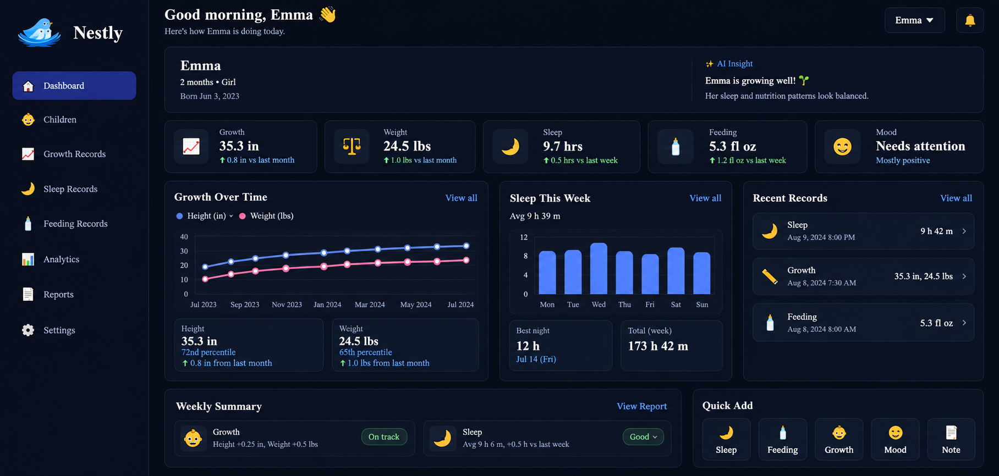
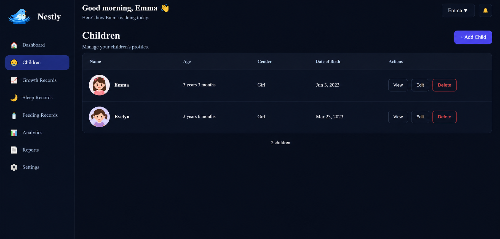
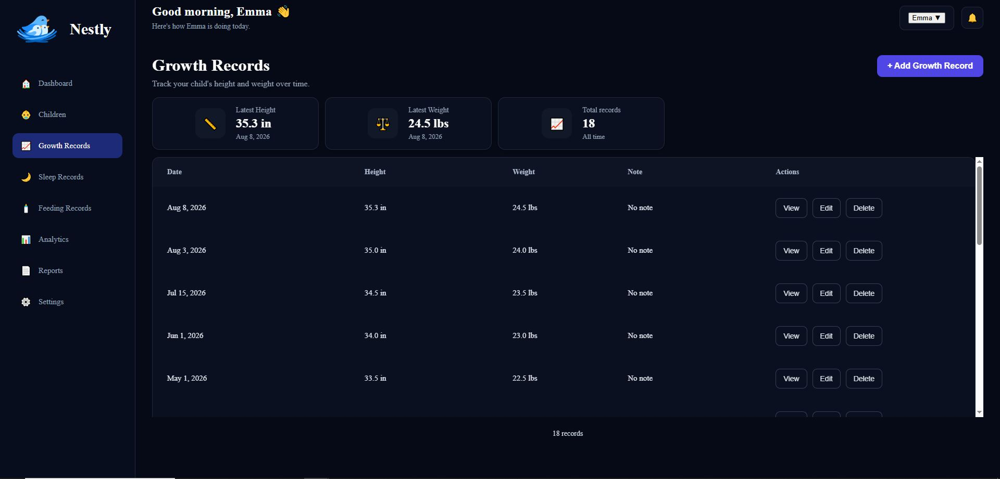
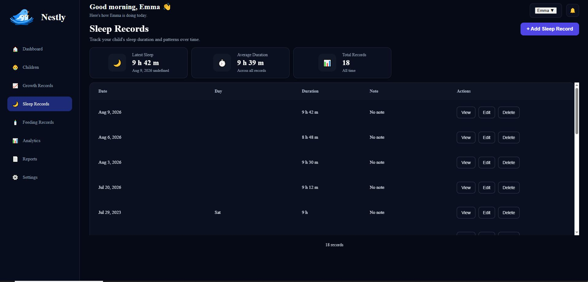
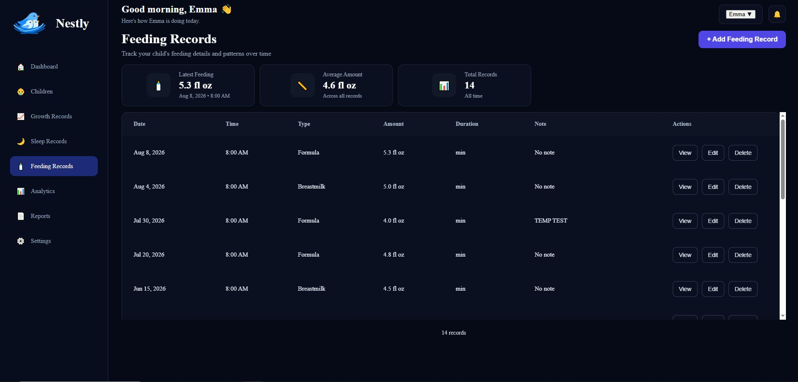
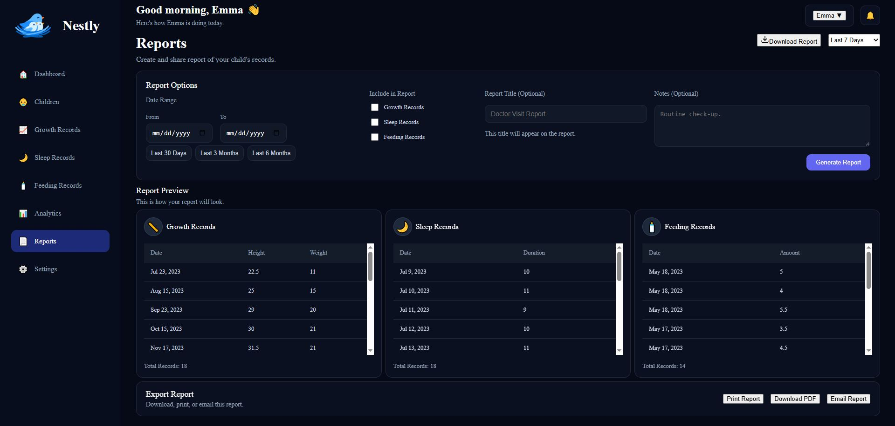
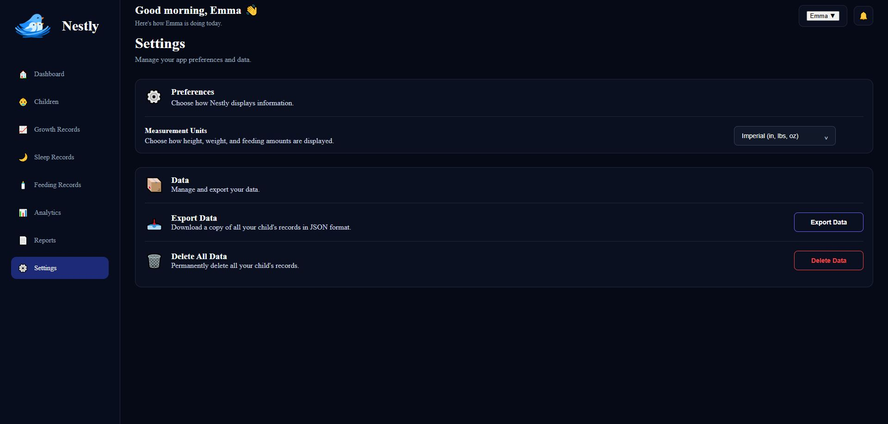

# Nestly

**Child Growth Tracker**

Nestly is a child growth tracking web application that helps parents record, manage, and monitor their child's growth, sleep, and feeding data.

The goal of Nestly is to make a child's records easier to track, understand, and eventually share with healthcare providers through organized reports.

I am building Nestly as a hands-on full-stack project while continuing to develop my skills in React, JavaScript, Node.js, Express, REST APIs, databases, and application architecture.

> 🚧 **Nestly is currently in active development.**

---

## Features

### Child Management

- Add a child
- Edit child information
- Delete a child
- Select and view individual children

### Growth Tracking

- Add growth records
- Edit existing growth records
- Delete growth records
- Track height and weight over time

### Sleep Tracking

- Add sleep records
- Edit sleep records
- Delete sleep records
- View sleep history and trends

### Feeding Tracking

- Add feeding records
- Edit feeding records
- Delete feeding records
- Manage feeding history

### Dashboard & Analytics

- View child information from a central dashboard
- Visualize growth and sleep data with Chart.js
- Filter and sort records by date
- Review recent records
- Navigate between Dashboard, Children, Growth, Sleep, Feeding, Analytics, Reports, and Settings

### Reports

Nestly includes a Reports page designed to organize a child's records into a format that parents can review and eventually share with healthcare providers.

**Current functionality:**

- View growth, sleep, and feeding records in a report format
- Filter records by a selected date range
- Preview records before sharing

**Planned functionality:**

- Print reports for appointments
- Email reports to healthcare providers

---

## Tech Stack

### Frontend

- React
- JavaScript
- HTML5
- CSS3
- React Router
- Vite
- Chart.js

### Backend

- Node.js
- Express.js
- REST API
- JSON

### Development Tools

- Git
- GitHub
- VS Code
- Chrome DevTools

---

## Application Structure

Nestly started as a frontend React application where user actions directly update application state.

```text
User Action
     ↓
Event Handler
     ↓
Data Update
     ↓
React State Update
     ↓
React Re-render
     ↓
Updated UI
```

I have since added an Express server and REST API.

I am currently connecting the React frontend to the server using `fetch()`.

```text
User Action
     ↓
React Event Handler
     ↓
fetch()
     ↓
HTTP Request
     ↓
Express REST API
     ↓
Server Logic
     ↓
JSON Response
     ↓
React State Update
     ↓
React Re-render
     ↓
Updated UI
```

The next stage will introduce a database for persistent storage:

```text
React Frontend
      ↓
   fetch()
      ↓
REST API
      ↓
Express / Node.js
      ↓
Database
```

---

## CRUD Implementation

Nestly currently includes frontend Create, Read, Update, and Delete functionality for:

- Children
- Growth records
- Sleep records
- Feeding records

React controlled forms are used to collect and edit user input.

Each child and record has a unique ID that allows the application to identify the correct data when updating or deleting records.

JavaScript array methods such as `map()` and `filter()` are used to create updated state without directly mutating the existing data.

---

## REST API

The backend is built with Node.js and Express.

I have implemented server-side CRUD endpoints to handle child data.

The API handles:

- HTTP requests
- Route parameters
- Request bodies
- CRUD operations
- JSON responses

The React frontend and Express server currently exist as separate parts of the application, and I am working on connecting them using `fetch()`.

---

## Project Status

### Completed

- ✅ React application structure
- ✅ Children frontend CRUD
- ✅ Growth Records frontend CRUD
- ✅ Sleep Records frontend CRUD
- ✅ Feeding Records frontend CRUD
- ✅ Controlled forms
- ✅ React Router navigation
- ✅ Record filtering and sorting
- ✅ Growth and sleep data visualization
- ✅ Reports page and record preview
- ✅ Report date-range filtering
- ✅ Express server setup
- ✅ Server-side CRUD endpoints
- ✅ REST API foundation

### Currently Working On

- 🔨 Connecting the React frontend to the Express API using `fetch()`
- 🔨 Replacing frontend-only data operations with API requests
- 🔨 Implementing the complete client → server → client data flow

### Next

- ⏳ Database integration
- ⏳ Persistent data storage
- ⏳ User signup and login
- ⏳ Authentication and protected routes
- ⏳ Validation and error handling
- ⏳ Report printing
- ⏳ Report sharing by email
- ⏳ Testing and final QA
- ⏳ Production deployment

---

## What I'm Learning

Building Nestly has helped me develop a stronger understanding of:

- React state and props
- Component communication and data flow
- Controlled forms
- CRUD architecture
- JavaScript array methods
- React Router
- REST APIs
- HTTP methods and requests
- Request and response cycles
- JSON
- Client-server architecture
- Express routing
- Debugging and tracing application data
- Git branching and incremental development

One of the most important concepts I have learned is understanding what happens to data after a user takes an action.

```text
User Action
→ Event Handler
→ Data Update
→ State Update
→ React Re-render
→ Updated UI
```

As I build the backend, I am extending that understanding across the entire application:

```text
User
→ React
→ HTTP Request
→ Express API
→ Server
→ Response
→ React State
→ UI
```

---

## Screenshots

### Dashboard

Overview of the selected child's growth, sleep, feeding, and recent records.



### Children Management

Add, view, edit, and delete child profiles.



### Growth Records

Track and manage a child's height and weight records over time.



### Sleep Records

Track sleep duration and manage individual sleep records.



### Feeding Records

Record and manage feeding history, amounts, feeding types, and notes.



### Reports

Filter growth, sleep, and feeding records by date range, preview records, and prepare reports for sharing with healthcare providers.



### Settings

Manage application preferences and data settings.



---

## Roadmap

My goal is to continue developing Nestly from a frontend React application into a complete full-stack application.

```text
React
  ↓
REST API
  ↓
Node.js / Express
  ↓
Database
```

The next major milestones are API integration, database persistence, authentication, testing, and deployment.

---

## Author

**Nathan Kim**

Front-End Developer

GitHub: github.com/nathanjkim-codes
